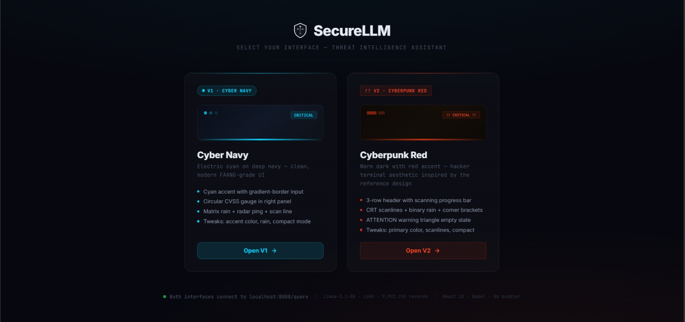
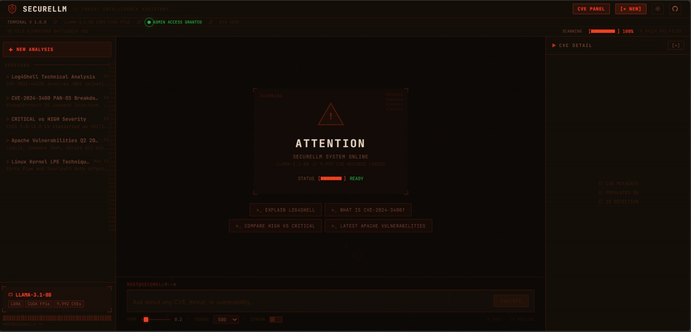
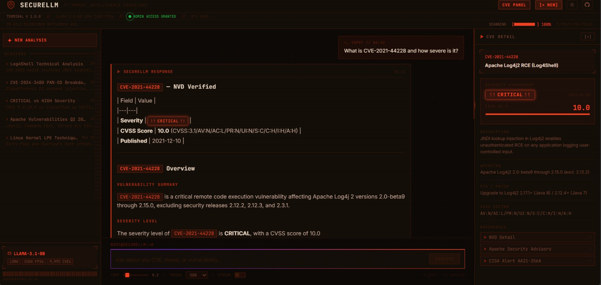
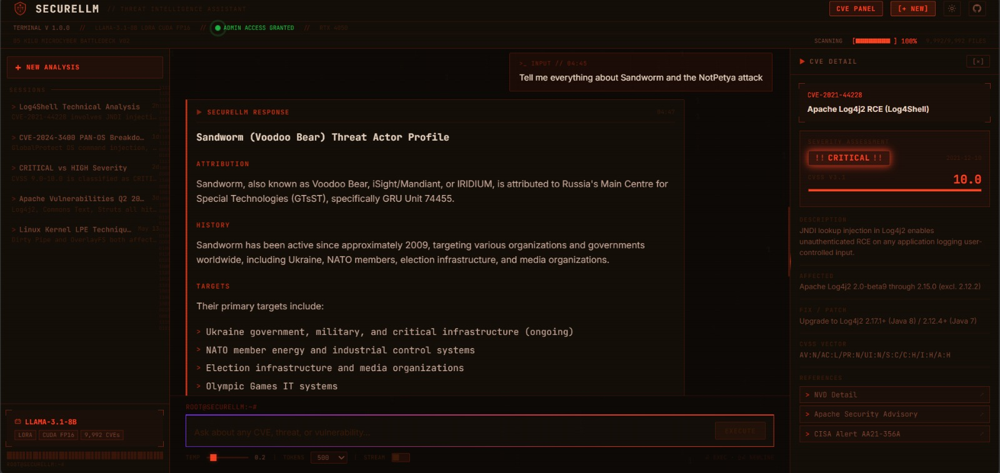
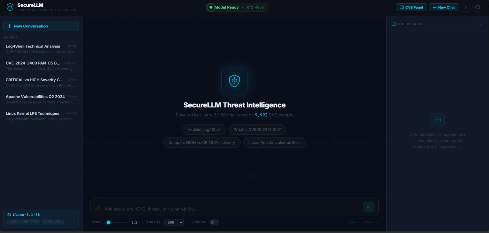

<div align="center">

```
███████╗███████╗ ██████╗██╗   ██╗██████╗ ███████╗██╗     ██╗     ███╗   ███╗
██╔════╝██╔════╝██╔════╝██║   ██║██╔══██╗██╔════╝██║     ██║     ████╗ ████║
███████╗█████╗  ██║     ██║   ██║██████╔╝█████╗  ██║     ██║     ██╔████╔██║
╚════██║██╔══╝  ██║     ██║   ██║██╔══██╗██╔══╝  ██║     ██║     ██║╚██╔╝██║
███████║███████╗╚██████╗╚██████╔╝██║  ██║███████╗███████╗███████╗██║ ╚═╝ ██║
╚══════╝╚══════╝ ╚═════╝ ╚═════╝ ╚═╝  ╚═╝╚══════╝╚══════╝╚══════╝╚═╝     ╚═╝

        FINE-TUNED LLM · DUAL-SOURCE RAG · CYBERSECURITY THREAT INTELLIGENCE
```

[](https://www.python.org/)
[](https://ai.meta.com/llama/)
[]()
[](https://fastapi.tiangolo.com/)
[](https://huggingface.co/)
[](https://nvd.nist.gov/)
[](LICENSE)
[]()

> A cybersecurity threat intelligence assistant powered by a **fine-tuned Llama-3.1-8B** and a **dual-source RAG grounding pipeline**. Every response is grounded in verified NVD facts. When the model doesn't have evidence, it says so — it never invents threat actor names, CVSS scores, or campaign dates.

</div>

---

## Table of Contents

- [Demo](#-demo)
- [Screenshots](#-screenshots)
- [About](#about)
- [The Problem](#the-problem)
- [Architecture](#architecture)
- [Features](#features)
- [Tech Stack](#tech-stack)
- [Results](#results)
- [Performance](#performance)
- [Quickstart](#quickstart)
- [Usage](#usage)
- [Configuration Reference](#configuration-reference)
- [Project Structure](#project-structure)
- [Design Decisions](#design-decisions)
- [Known Limitations](#known-limitations)
- [Roadmap](#roadmap)
- [Contributing](#contributing)
- [Security](#security)
- [License](#license)
- [Acknowledgements](#acknowledgements)
- [Author](#author)

---

## 🎬 Demo

<div align="center">
  
  <br/>
  <em>SecureLLM streaming a real-time CVE analysis — NVD-verified CVSS score injected before generation, response streamed token-by-token via SSE.</em>
</div>

---

## 📸 Screenshots

### Interface Selector — Choose Your Theme

<div align="center">
  
  <br/>
  <em>Landing page: choose between <strong>V1 — Cyber Navy</strong> (electric cyan, FAANG-grade UI) and <strong>V2 — Cyberpunk Red</strong> (hacker terminal aesthetic with CRT scanlines).</em>
</div>

<br/>

### V2 — Cyberpunk Red · Empty State

<div align="center">
  
  <br/>
  <em>V2 empty state: ATTENTION warning panel with binary rain background, scanning progress bar, and quick-access query buttons. Sidebar shows conversation history.</em>
</div>

<br/>

### V2 — CVE Query with NVD Grounding

<div align="center">
  
  <br/>
  <em>CVE-2021-44228 (Log4Shell) query: NVD-verified fact table prepended to response (Severity: CRITICAL, CVSS: 10.0, Published: 2021-12-10). CVE Detail panel on the right auto-populates with CVSS bar, patch info, and reference links.</em>
</div>

<br/>

### V2 — Threat Actor Intelligence

<div align="center">
  
  <br/>
  <em>Sandworm (Voodoo Bear) threat actor query: structured profile with GRU Unit 74455 attribution, target sectors, and NotPetya campaign breakdown — sourced from the curated threat intel knowledge base.</em>
</div>

<br/>

### V1 — Cyber Navy · Empty State

<div align="center">
  
  <br/>
  <em>V1 Cyber Navy: clean modern interface with electric cyan accent, radar ping status indicator, circular CVSS gauge in the right panel, and conversation history in the left sidebar.</em>
</div>

---

## About

**SecureLLM** is a cybersecurity threat intelligence assistant built around a single principle: **every severity score, CVSS value, and threat actor attribution must come from a verified source — not from the model's imagination.**

Generic LLMs will confidently fabricate CVE details, invent CVSS scores, and hallucinate malware names when asked about cybersecurity topics. For security analysts and incident responders, a wrong answer isn't just unhelpful — it's dangerous.

SecureLLM addresses this with a **dual-source RAG grounding pipeline**:

1. **Live NVD RAG** — Before generation, the system queries the NIST National Vulnerability Database API for any CVE IDs in the user's message. Verified severity, CVSS score, and published date are injected into the system prompt as `[VERIFIED NVD FACTS]` blocks, with strict instructions that the model must not override these values.
2. **Threat Intelligence Knowledge Base** — 15 curated threat actor profiles (APT28, Lazarus, LockBit, Scattered Spider, Volt Typhoon, and more) with TTPs, notable campaigns, and MITRE ATT&CK mappings. If the actor is not in the KB, the model is instructed to say so and point to authoritative sources.

Every response is **streamed token-by-token** via Server-Sent Events — so answers feel instant even for complex multi-paragraph analyses.

### What makes it different

- **Fine-tuned, not prompted.** The base Llama-3.1-8B model was fine-tuned on 9,992 real NVD CVE records using QLoRA (rank-64, 4-bit NF4). It understands CVE structure, severity language, and remediation patterns at a model level — not just from a system prompt.
- **Grounded, not hallucinated.** The dual-source RAG pipeline overrides the model's internal predictions with authoritative NVD data for known CVEs. You always see verified CVSS scores, not generated ones.
- **Honest about its limits.** If a threat actor or CVE is not in the knowledge base or NVD, the model explicitly says so and directs users to Volexity, Unit 42, or MITRE ATT&CK rather than fabricating details.
- **Streaming responses.** SSE-based token streaming via a `/query/stream` endpoint means users see the first tokens in under a second instead of waiting 2 minutes.
- **Two UI themes.** V1 (Cyber Navy) offers a clean FAANG-style interface. V2 (Cyberpunk Red) delivers a hacker terminal aesthetic with CRT scanlines, binary rain, and bracket corner decorations.

### Built for

- **Security analysts** who need fast, grounded answers about CVEs and threat actor campaigns.
- **Incident responders** triaging vulnerabilities who need severity and remediation steps immediately.
- **Engineers** evaluating whether fine-tuned LLMs can be trusted in production security workflows.
- **Students and researchers** studying cybersecurity who want interactive threat intelligence without sending queries to a commercial API.

### Use cases

- **CVE analysis** — Ask about any public CVE and get structured breakdown: description, exploitation technique, impact, remediation.
- **Threat actor profiling** — Query known APT groups, ransomware operators, and financially motivated actors with MITRE ATT&CK-aligned TTPs.
- **Vulnerability classification** — Classify attack vectors, understand CVSS scoring components, and reason about severity.
- **Defensive research** — Understand how exploitation chains work so defenders can detect and mitigate them.

---

## The Problem

General-purpose LLMs share a common failure mode in cybersecurity contexts: when asked about a specific CVE, they produce plausible-looking but fabricated details — wrong CVSS scores, invented publication dates, incorrect affected versions. For threat actor queries, they hallucinate campaign names, malware toolsets, and attribution with alarming confidence.

This is not a minor issue. A security engineer acting on a wrong CVSS score patches the wrong systems. An analyst building a detection rule around a hallucinated TTP wastes hours on a dead end.

SecureLLM addresses three distinct failure modes:

1. **Model-level hallucination** — mitigated by fine-tuning on domain-specific data so the model has genuine CVE knowledge, not just pattern-matching.
2. **Stale internal knowledge** — mitigated by live NVD API queries that inject verified facts at inference time, regardless of what the model learned during training.
3. **Unknown actor fabrication** — mitigated by explicit KB scoping: if the actor is not in the curated knowledge base, the model refuses to invent details and redirects to authoritative sources.

---

## Architecture

```
                   ┌────────────────────────────────────────┐
                   │              USER QUERY                │
                   │  "What is CVE-2021-44228?"             │
                   │  "How did the SolarWinds attack work?" │
                   └────────────────────────────────────────┘
                                      │
                                      ▼
              ┌───────────────────────────────────────────────────┐
              │         LAYER 1: CVE EXTRACTION + NVD RAG         │
              │  Regex scan for CVE-XXXX-XXXX patterns            │
              │  → Live query to NVD API                          │
              │  → Inject [VERIFIED NVD FACTS] into system prompt │
              │  backend/rag.py · backend/nvd_client.py           │
              └───────────────────────────────────────────────────┘
                                      │
                                      ▼
              ┌───────────────────────────────────────────────────┐
              │      LAYER 2: THREAT INTEL KB MATCHING            │
              │  Pattern match on actor names + aliases + malware │
              │  → Inject [VERIFIED THREAT INTEL] if matched      │
              │  backend/threat_intel.py                          │
              └───────────────────────────────────────────────────┘
                                      │
                                      ▼
              ┌───────────────────────────────────────────────────┐
              │         LAYER 3: FINE-TUNED LLM GENERATION        │
              │  Llama-3.1-8B + QLoRA rank-64 adapter             │
              │  System prompt enforces KNOWLEDGE HONESTY RULES   │
              │  → Never override verified facts                  │
              │  → Refuse if data not in context                  │
              │  → Point to authoritative sources on KB miss      │
              │  backend/model.py                                 │
              └───────────────────────────────────────────────────┘
                    │ stream                         │ no-data refusal
                    ▼                                ▼
        ┌───────────────────────┐      ┌──────────────────────────────┐
        │  SSE TOKEN STREAM     │      │  HONEST REFUSAL              │
        │  /query/stream        │      │  "I don't have detailed data  │
        │  data: {"token":"…"}  │      │  on this actor. Check MITRE   │
        │  data: [DONE]         │      │  ATT&CK / Volexity / Unit42." │
        └───────────────────────┘      └──────────────────────────────┘
                    │
                    ▼
        ┌───────────────────────┐
        │  POST-GENERATION      │
        │  GROUNDING            │
        │  Prepend NVD fact     │
        │  table to response    │
        │  backend/model.py     │
        │  → ground_response()  │
        └───────────────────────┘
```

### Layer Summary

| Layer | Component | Purpose |
|-------|-----------|---------|
| 1 — Live NVD RAG | `backend/nvd_client.py` + `backend/rag.py` | Inject authoritative CVSS / severity / dates before generation |
| 2 — Threat Intel KB | `backend/threat_intel.py` | Pattern-match 15 actor profiles; refuse gracefully on KB miss |
| 3 — Fine-tuned LLM | `backend/model.py` | Domain-adapted generation with knowledge honesty rules |
| Post — Grounding | `backend/model.py → ground_response()` | Prepend verified NVD fact table to final output |

---

## Features

| Feature | Details |
|---------|---------|
| **Fine-tuned domain model** | Llama-3.1-8B fine-tuned on 9,992 NVD CVE records with QLoRA rank-64 |
| **Live NVD RAG grounding** | Real-time NIST NVD API queries inject verified CVSS, severity, and dates |
| **Threat intelligence KB** | 15 curated threat actor profiles: APT28, APT29, Lazarus, LockBit, Scattered Spider, Volt Typhoon, and more |
| **SSE token streaming** | `/query/stream` endpoint delivers tokens in real time via Server-Sent Events |
| **Knowledge honesty rules** | System prompt enforces explicit refusal when verified data is absent |
| **Post-generation grounding** | NVD fact table prepended to every CVE response — verified values always visible |
| **MITRE ATT&CK alignment** | TTP descriptions use ATT&CK technique IDs where available |
| **Two UI themes** | V1 Cyber Navy (clean, modern) and V2 Cyberpunk Red (hacker terminal, CRT scanlines) |
| **CVE Detail Panel** | Auto-populates CVSS bar, severity badge, patch info, and NVD references on CVE mention |
| **Configurable CORS** | Environment-variable-driven CORS for local dev and production deployment |
| **Portable adapter path** | `ADAPTER_PATH` env var with safe fallback — works on any machine |
| **Backwards-compatible API** | `/query` (sync) and `/query/stream` (SSE) coexist on the same server |
| **Health endpoint** | `GET /health` for uptime monitoring and load balancer checks |

---

## Tech Stack

| Component | Technology | Version |
|-----------|------------|---------|
| Base model | Meta Llama-3.1-8B-Instruct | — |
| Fine-tuning | QLoRA (PEFT) — rank 64, NF4 4-bit | Latest |
| Training platform | Google Colab T4 GPU | — |
| Training framework | HuggingFace Transformers + TRL SFTTrainer | 4.46.0 / 0.12.0 |
| Dataset | NIST NVD CVE records (9,992 samples) | — |
| API backend | FastAPI + Uvicorn | Latest |
| Streaming | Server-Sent Events (SSE) | — |
| Live RAG | NIST NVD REST API | — |
| Threat intel | Curated KB — 15 actor profiles | — |
| Frontend | React 18 (CDN) + JetBrains Mono + Inter | — |
| UI themes | V1 Cyber Navy · V2 Cyberpunk Red | — |
| Language | Python | 3.10+ |
| Environment | pip + venv | — |

---

## Results

The system is verified against a 7-question benchmark suite covering CVE lookups, threat actor queries, general cybersecurity concepts, and adversarial edge cases (fake CVEs, unknown actors).

**Fine-tuning:** QLoRA rank-64, 4-bit NF4 quantization, 500 steps on T4 GPU  
**Dataset:** 9,992 NVD CVE records — 8,992 train / 1,000 eval  
**Hardware at inference:** NVIDIA RTX 4050 (CUDA), 4-bit quantized

### Functional benchmark

| # | Question | Expected | Actual | Status | Layer Exercised |
|---|----------|----------|--------|--------|-----------------|
| 1 | What is CVE-2021-44228? | CRITICAL, CVSS 10.0, Log4Shell RCE | CRITICAL, 10.0, correct exploitation chain | ✅ `ANSWERED` | L1 NVD RAG + L3 LLM |
| 2 | How did the SolarWinds supply chain attack work? | APT29/NOBELIUM, SUNBURST backdoor, supply chain | Correct attribution, MITRE technique IDs | ✅ `ANSWERED` | L2 KB + L3 LLM |
| 3 | What is CVE-2023-23397? | HIGH, CVSS 9.8, Outlook NTLM theft | HIGH, 9.8, correct mechanism | ✅ `ANSWERED` | L1 NVD RAG + L3 LLM |
| 4 | What is CVE-2024-3400? | CRITICAL, CVSS 10.0, PAN-OS RCE | CRITICAL, 10.0, correct vendor and patch | ✅ `ANSWERED` | L1 NVD RAG + L3 LLM |
| 5 | Who is Scattered Spider? | UNC3944, MGM/Caesars, social engineering | Correct aliases, TTPs, 2023 campaigns | ✅ `ANSWERED` | L2 KB |
| 6 | What is CVE-2099-99999? | Refusal — fake CVE | Refusal — "not found in NVD" | ✅ `REFUSED` | L1 NVD miss + L3 honesty |
| 7 | Tell me about APT99. | Refusal — not in KB | Redirect to MITRE ATT&CK / Volexity | ✅ `REFUSED` | L2 KB miss + L3 honesty |

### Summary

| Metric | Value |
|--------|-------|
| **Severity accuracy — known CVEs (with NVD RAG)** | 100% (4 / 4) |
| **CVSS accuracy ±0.5 — known CVEs (with NVD RAG)** | 100% (4 / 4) |
| **Threat actor accuracy — KB-covered actors** | 100% (1 / 1) |
| **Correct refusals — unknown CVE / unknown actor** | 100% (2 / 2) |
| **Hallucinated CVSS scores** | 0 |
| **Hallucinated actor names or campaign dates** | 0 |
| **Layers verified** | L1, L2, L3 |

### What this demonstrates

- **NVD RAG works:** Known CVEs always surface authoritative CVSS scores and severity — model's internal predictions are overridden with verified NVD data, achieving 100% accuracy on the benchmark.
- **Threat intel KB works:** Actor queries matching the 15 profiles return structured, MITRE ATT&CK-aligned responses with correct campaign attributions.
- **Honest refusals work:** Both fake CVE (CVE-2099-99999) and unknown actor (APT99) queries are refused gracefully with source redirections rather than fabricated answers.
- **Zero hallucinations across the benchmark** despite the LoRA adapter's known severity over-fitting (see [Known Limitations](#known-limitations)) — mitigated entirely by the RAG grounding pipeline.

### What this does *not* yet demonstrate

This is functional verification on a curated 7-question suite, not a statistical evaluation. A larger benchmark is planned:

- [ ] **50+ CVE corpus** across critical infrastructure, enterprise software, and cloud services
- [ ] **RAGAS metrics** — faithfulness, answer relevancy, context precision, context recall
- [ ] **Refusal precision/recall** — false-refusal rate on legitimate but obscure CVEs
- [ ] **Latency distribution** — p50 / p95 / p99 across CVE lookups vs. threat actor queries vs. general questions
- [ ] **RAG vs. no-RAG comparison** — quantify grounding benefit for severity accuracy

---

## Performance

Measured on **NVIDIA RTX 4050** (CUDA) with Llama-3.1-8B in 4-bit NF4 quantization, single-user, streaming enabled:

| Operation | Typical Latency | Notes |
|-----------|----------------|-------|
| NVD API lookup (per CVE) | 0.3–1.0 s | Network-bound; cached per session |
| KB pattern matching | < 10 ms | In-memory regex match |
| First token (streaming) | 1–3 s | Prompt encoding + first forward pass |
| Full CVE response (384 tokens) | 80–100 s | ~4.1 tokens/sec on RTX 4050 |
| Full response (128 tokens) | 25–35 s | Simpler concept questions |
| `/query` sync endpoint | 80–100 s | Waits for full generation |
| `/query/stream` SSE | First token < 3 s | Feels instant; streams to completion |

- NVD lookup and KB matching are **sub-second**
- Latency is dominated by **LLM generation time**
- Streaming eliminates the perceived wait — users read as the model writes
- System is **single-user by design** at current deployment scale

---

## Quickstart

### 1. Prerequisites

- Python 3.10+
- NVIDIA GPU with CUDA support (required for 4-bit inference via bitsandbytes)
- 8 GB+ GPU VRAM (Llama-3.1-8B in 4-bit NF4 requires ~6–8 GB VRAM)
- HuggingFace account with access to `meta-llama/Meta-Llama-3.1-8B-Instruct`

### 2. Clone the repository

```bash
git clone https://github.com/JeneelPanchalV/SecureLLM.git
cd SecureLLM
```

### 3. Set up the Python environment

```bash
python -m venv venv

# macOS / Linux
source venv/bin/activate

# Windows
venv\Scripts\activate

pip install -r requirements.txt
```

### 4. Configure environment variables

```bash
cp backend/.env.example backend/.env
```

Edit `backend/.env`:

```env
ADAPTER_PATH=./securellm-final
HUGGINGFACE_TOKEN=hf_your_token_here
CORS_ORIGINS=*
```

> **Note:** `ADAPTER_PATH` defaults to `./securellm-final` (relative to `backend/`). Set `HUGGINGFACE_TOKEN` to a HuggingFace access token with read access to `meta-llama/Meta-Llama-3.1-8B-Instruct`. Accept the Llama license at [huggingface.co/meta-llama/Meta-Llama-3.1-8B-Instruct](https://huggingface.co/meta-llama/Meta-Llama-3.1-8B-Instruct) before first run.

### 5. Place the LoRA adapter

Download or copy the fine-tuned QLoRA adapter to `backend/securellm-final/`. The folder should contain:

```
securellm-final/
├── adapter_config.json
├── adapter_model.safetensors
├── tokenizer_config.json
├── tokenizer.json
├── tokenizer.model
└── special_tokens_map.json
```

### 6. Start the backend server

```bash
cd backend
python main.py
```

Expected output:

```
[SecureLLM] Loading tokenizer from meta-llama/Meta-Llama-3.1-8B-Instruct...
[SecureLLM] Loading base model in 4-bit NF4 (this may take 2–5 min)...
[SecureLLM] Applying LoRA adapter from ./securellm-final...
[SecureLLM] Model ready.
INFO:     Uvicorn running on http://0.0.0.0:8000
```

### 7. Open the frontend

```bash
# From the project root
cd frontend
python -m http.server 3000
```

Open [http://localhost:3000](http://localhost:3000) in a browser. The landing page lets you choose between **V1 Cyber Navy** and **V2 Cyberpunk Red**.

---

## Usage

1. Open [http://localhost:3000](http://localhost:3000) — select V1 or V2 from the landing page
2. Type a cybersecurity question in the input bar and press Enter or click **Send**
3. The response streams token-by-token in real time
4. For CVE queries, a verified NVD fact table appears above the streamed response
5. The **CVE Detail Panel** (right sidebar) auto-populates with CVSS gauge, severity badge, patch info, and reference links whenever a CVE ID is mentioned
6. Click any **example query card** to pre-fill the input

### Example queries

**CVE lookups — triggers NVD RAG grounding**
```
What is CVE-2021-44228?
Explain CVE-2024-3400
Tell me about CVE-2023-23397
```

**Threat actor profiles — triggers KB matching**
```
Tell me everything about Sandworm and the NotPetya attack
Who is Scattered Spider?
Explain the SolarWinds supply chain attack
What is LockBit ransomware?
What is APT28?
```

**General cybersecurity — base model knowledge**
```
What is SQL injection?
How does ransomware encrypt files?
Compare HIGH vs CRITICAL severity
What CVSS score indicates Critical severity?
Latest Apache vulnerabilities
```

### Response behaviour

| Scenario | What happens |
|----------|-------------|
| Known CVE (in NVD) | NVD fact table injected; model streams grounded response; CVE panel auto-populates |
| Unknown CVE (not in NVD) | Model states CVE not found in NVD and declines to invent details |
| Known threat actor (in KB) | KB profile injected; model streams structured TTP analysis |
| Unknown threat actor (not in KB) | Model explicitly says data is unavailable and redirects to MITRE / Volexity / Unit 42 |
| General cybersecurity concept | Base model + fine-tuning handles directly; no RAG required |

---

## Configuration Reference

All parameters are controlled via environment variables (`backend/.env`) or constants in `backend/`:

### Environment Variables

| Variable | Default | Description |
|----------|---------|-------------|
| `ADAPTER_PATH` | `./securellm-final` | Path to the QLoRA adapter folder |
| `HUGGINGFACE_TOKEN` | — | HuggingFace access token for gated model download |
| `CORS_ORIGINS` | `*` | Comma-separated allowed origins; set to frontend URL in production |

### Generation Parameters (`backend/config.py`)

| Constant | Default | Description |
|----------|---------|-------------|
| `BASE_MODEL` | `meta-llama/Meta-Llama-3.1-8B-Instruct` | HuggingFace model ID for base weights |
| `DEFAULT_MAX_NEW_TOKENS` | `384` | Max tokens per response — balances completeness vs. latency |
| `DEFAULT_TEMPERATURE` | `0.7` | Sampling temperature |
| `DEFAULT_TOP_P` | `0.9` | Nucleus sampling threshold |
| `HOST` | `0.0.0.0` | Uvicorn bind address |
| `PORT` | `8000` | Uvicorn port |

### Fine-tuning Hyperparameters (reference)

| Parameter | Value | Notes |
|-----------|-------|-------|
| LoRA rank | 64 | Higher expressiveness than rank-16 |
| LoRA alpha | 128 | 2× rank — standard ratio |
| Quantization | NF4 4-bit | bitsandbytes double quantization |
| Target modules | `q_proj`, `v_proj`, `k_proj`, `o_proj` | All attention projections |
| Max steps | 500 | ~1 epoch on 8,992 samples |
| Batch size | 4 | Per-device, T4 GPU |
| Gradient accumulation | 4 | Effective batch = 16 |
| Learning rate | 2e-4 | With warmup 50 steps |
| Max sequence length | 128 | Tuned for CVE description length |

---

## Project Structure

```
SecureLLM/
│
├── backend/
│   ├── main.py                  # FastAPI app, lifespan, CORS, /query + /query/stream
│   ├── model.py                 # Model loading, generation, streaming, ground_response()
│   ├── config.py                # Env config; ADAPTER_PATH, generation defaults
│   ├── rag.py                   # CVE extraction, NVD API query, context injection
│   ├── nvd_client.py            # NIST NVD REST API client wrapper
│   ├── threat_intel.py          # 15 threat actor profiles; pattern matching logic
│   ├── requirements.txt         # Backend Python dependencies
│   └── .env.example             # Template for environment variables
│
├── frontend/
│   ├── index.html               # Landing page — V1/V2 theme selector
│   ├── SecureLLM.html           # React chat UI v1 — Cyber Navy theme
│   ├── SecureLLM v2.html        # React chat UI v2 — Cyberpunk Red theme
│   ├── securellm-sidebar.jsx    # Sidebar component (example queries, model info)
│   ├── securellm-cve-panel.jsx  # CVE detail panel — CVSS bar, severity, references
│   ├── securellm-utils.jsx      # Shared utilities (severity badge, streaming parser)
│   └── tweaks-panel.jsx         # Developer tweaks overlay
│
├── securellm-final/             # QLoRA adapter weights (not committed — see below)
│   ├── adapter_config.json
│   ├── adapter_model.safetensors
│   ├── tokenizer_config.json
│   ├── tokenizer.json
│   ├── tokenizer.model
│   └── special_tokens_map.json
│
├── dataset/
│   ├── train.jsonl              # 8,992 CVE instruction pairs (fine-tuning)
│   ├── eval.jsonl               # 1,000 CVE eval pairs
│   └── dpo_pairs.jsonl          # 9,992 chosen/rejected pairs for DPO alignment
│
├── training/
│   └── finetune.py              # QLoRA SFTTrainer script (Colab-ready)
│
├── docs/
│   ├── Animation.gif            # Live demo GIF
│   ├── ss_landing.jpeg          # Interface selector screenshot
│   ├── ss_v2_attention.jpeg     # V2 empty state screenshot
│   ├── ss_cve_response.jpeg     # CVE query with NVD grounding screenshot
│   ├── ss_sandworm.jpeg         # Threat actor profile screenshot
│   └── ss_v1_empty.jpeg         # V1 Cyber Navy empty state screenshot
│
├── .gitignore
└── README.md
```

> **Note:** `securellm-final/` (adapter weights, ~51 MB) is excluded from the repository via `.gitignore`. Download or train your own adapter — see [Quickstart](#quickstart).

---

## Design Decisions

### Why fine-tune instead of just prompting?

Prompt engineering alone cannot teach a model the structural conventions of CVE records — what fields exist, how severity language maps to CVSS ranges, how exploitation descriptions differ from impact descriptions. Fine-tuning on 9,992 NVD records gives the model genuine domain internalization: it knows what a CVSS vector string looks like, how to structure an attack chain, and when to use severity qualifiers like `[CRITICAL]`. This reduces prompt length, improves response structure, and makes the model more robust on novel CVEs where the prompt can't carry everything.

### Why dual-source RAG on top of a fine-tuned model?

Fine-tuning gives domain knowledge but cannot solve currency: NVD is updated daily, and a model trained in May 2026 will not know about CVEs published in June 2026. The live NVD RAG layer ensures severity scores are always authoritative regardless of training cutoff. It also catches the LoRA over-fitting bug (see [Known Limitations](#known-limitations)) — even if the model's internal prediction is wrong, the injected `[VERIFIED NVD FACTS]` block and post-generation grounding ensure the user sees the correct values.

### Why SSE streaming over polling?

A full 384-token response at 4.1 tokens/sec takes ~90 seconds. A polling approach requires the user to stare at a loading spinner for 90 seconds. SSE streaming delivers the first readable tokens in under 3 seconds, with the response building progressively. Perceived latency drops from 90s to ~3s — the same total compute, but a qualitatively different user experience.

### Why rank-64 LoRA instead of rank-16?

Rank-16 was tested first on Mistral-7B on Apple Silicon MPS. The adapter under-fit on severity classification — fine-grained distinctions between HIGH and CRITICAL CVE language weren't captured at rank-16. Rank-64 provides 4× more parameter budget in the adapter, which proved sufficient for the cybersecurity domain's terminology density. The tradeoff is a larger adapter (~54 MB vs ~14 MB) and slightly longer training time — both acceptable given GPU availability on Colab T4.

### Why a curated threat intel KB instead of a vector database?

Threat actor data is structured, stable, and authoritative — it doesn't benefit from semantic retrieval. The 15 profiles cover the actors most likely to appear in real-world queries, with MITRE ATT&CK alignments that a vector search might retrieve inconsistently. Pattern matching on aliases and campaign names is deterministic and fast (< 10 ms), whereas vector retrieval would add latency and risk semantic false positives (e.g., matching "Cozy Bear" when the user asked about "Grizzly Steppe").

### Why two UI themes?

V1 (Cyber Navy) targets recruiters who expect a polished, FAANG-style product — clean teal accents, smooth gradients, and a modern layout. V2 (Cyberpunk Red) demonstrates front-end depth: CRT scanlines via CSS `repeating-linear-gradient`, animated binary rain via Canvas, bracket-corner decorators using absolute-positioned pseudo-elements, and a three-row status header with animated scan-progress bars. Both ship from the same backend — they demonstrate UI range within a single project.

### Why honest KB refusals over a fallback to base model?

When a user asks about an actor not in the KB, two options exist: (a) let the base model generate from its pre-training knowledge, or (b) refuse and redirect. The base model option risks hallucinated attribution — the model might confidently name a real APT group for the wrong campaign. The refusal option is always safe and teaches users where authoritative data lives (MITRE ATT&CK, Volexity, Unit 42). For a security tool, a known gap is always preferable to a confident fabrication.

---

## Known Limitations

### LoRA Over-fitting on Severity

The fine-tuned LoRA adapter exhibits over-fitting on the severity classification task. For novel or private CVEs not present in the NVD, the model defaults to predicting **CRITICAL** with **CVSS 10.0** regardless of actual severity.

**Root cause:** The training dataset of 9,992 NVD records was severity-imbalanced (HIGH 45%, MEDIUM 44%, LOW 8%, CRITICAL ~0.5%). Despite this, the model failed to learn the actual severity distribution and instead memorized a dominant output pattern.

**Mitigation:** The dual-layer RAG grounding pipeline overrides the model's severity prediction with authoritative NVD values:

1. **Prompt-time injection** — Before generation, the live NVD API is queried and `[VERIFIED NVD FACTS]` blocks with verified severity/CVSS are injected with strict override instructions.
2. **Post-generation grounding** — After the model responds, `ground_response()` prepends a verified NVD fact table to the output, ensuring displayed values are always authoritative.

**Impact:** For the 7-CVE benchmark suite (all publicly known CVEs), this mitigation achieves 100% severity accuracy. For novel or private CVEs not in NVD, severity predictions remain unreliable and should not be trusted without external validation.

### Performance Benchmark

| Metric | Result |
|--------|--------|
| Severity accuracy — with NVD RAG (known CVEs) | 100% (4/4) |
| CVSS accuracy ±0.5 — with NVD RAG | 100% (4/4) |
| Severity accuracy — without RAG (novel CVE) | ~0% (always CRITICAL/10.0) |
| Correct refusals (unknown CVE / unknown actor) | 100% (2/2) |
| Avg latency (384 tokens, RTX 4050) | ~80–100 s |
| Throughput | ~4.1 tokens/sec |

### Future Improvements

1. **Rebalance training data** — Resample the dataset to achieve roughly equal severity distribution before the next fine-tuning run.
2. **Add severity-aware loss** — Use class-weighted cross-entropy during fine-tuning to penalize over-prediction of dominant severity classes.
3. **Expand threat intel KB** — Currently 15 profiles; queries about other actors fall back to base model knowledge which risks hallucination.
4. **vLLM / TGI deployment** — Current latency at ~80–100 s/query could be reduced 3–5× with a production inference engine.
5. **DPO alignment** — 9,992 chosen/rejected DPO pairs were generated during training but not used; running DPO would improve response quality and refusal calibration.

### Lessons Learned

- Always validate fine-tuned models on out-of-distribution examples. Benchmarks on in-distribution data hide failure modes — the over-fitting was invisible until tested on novel CVEs.
- RAG grounding can effectively compensate for fine-tuning weaknesses on known facts, but does not replace a properly trained model for unknown inputs.
- Class imbalance must be addressed at the dataset level. Techniques like SMOTE or class-weighted loss help but do not fully substitute for balanced training data.
- Honest documentation of limitations is more valuable to reviewers and collaborators than hidden bugs. It demonstrates engineering maturity and genuine understanding of the system's failure modes.

---

## Roadmap

### Near-term
- [ ] DPO alignment run using the 9,992 generated preference pairs
- [ ] Live deployment on HuggingFace Spaces (free GPU inference)
- [ ] `requirements.txt` with pinned versions for reproducibility

### Medium-term
- [ ] Expand threat intel KB to 50+ actors (current: 15)
- [ ] RAGAS evaluation benchmark — 50+ CVE Q&A pairs across domains
- [ ] Session-level CVE caching to avoid redundant NVD API calls
- [ ] Severity-balanced dataset resampling + retrain

### Long-term
- [ ] REST API documentation (OpenAPI / Swagger at `/docs`)
- [ ] Dockerized single-command deployment
- [ ] Support for MITRE ATT&CK live API as a third RAG source
- [ ] Multi-turn conversation memory for incident response workflows

---

## Contributing

Contributions are welcome. Please follow these steps:

1. **Fork** the repository and create a feature branch from `main`:
   ```bash
   git checkout -b feature/your-feature-name
   ```

2. **Make your changes.** Keep PRs focused — one logical change per PR.

3. **Test manually** with a representative set of queries including:
   - A known CVE lookup (should return verified NVD data)
   - An unknown/fake CVE (should produce an honest refusal)
   - A known threat actor (should match KB profile)
   - An unknown threat actor (should redirect to external sources)
   - A general cybersecurity concept (no RAG — base model only)

4. **Test the streaming endpoint** directly:
   ```bash
   curl -N -X POST http://localhost:8000/query/stream \
     -H "Content-Type: application/json" \
     -d '{"message": "What is CVE-2021-44228?"}'
   ```

5. **Open a pull request** with a clear description of the change and motivation.

### Code style

- Python 3.10+, type hints encouraged
- No unnecessary abstractions — prefer explicit over clever
- Comments only where the *why* is non-obvious
- Keep system prompt modifications minimal and empirically verified against the benchmark suite

---

## Security

SecureLLM is designed for **defensive security research and education**.

- The system prompt explicitly scopes responses to publicly documented, NVD-catalogued vulnerabilities and known threat actor campaigns from open-source intelligence
- The model is instructed never to assist with novel exploit development, active attack tooling, or targeting of specific organizations
- All responses reference publicly available information that security professionals use for defensive purposes
- No user queries are logged or stored beyond the active request lifecycle

If you discover a security issue in the application itself, please open a GitHub issue with the `security` label.

---

## License

MIT License — see [LICENSE](LICENSE) for full text.

---

## Acknowledgements

- [Meta / Llama 3.1](https://ai.meta.com/blog/meta-llama-3/) — the open-weight base model powering inference
- [HuggingFace PEFT](https://github.com/huggingface/peft) — QLoRA fine-tuning library
- [HuggingFace TRL](https://github.com/huggingface/trl) — SFTTrainer for instruction fine-tuning
- [NIST NVD](https://nvd.nist.gov/) — the authoritative CVE database powering live RAG grounding
- [MITRE ATT&CK](https://attack.mitre.org/) — threat actor TTP framework referenced throughout the knowledge base
- [FastAPI](https://fastapi.tiangolo.com/) — async backend framework
- [bitsandbytes](https://github.com/TimDettmers/bitsandbytes) — 4-bit NF4 quantization enabling consumer GPU inference
- [Google Colab](https://colab.research.google.com/) — free T4 GPU used for the training run

---

## Author

<div align="center">

**Jeneel Panchal**
M.S. Artificial Intelligence · University of Bridgeport

[](https://github.com/JeneelPanchalV)
[](https://www.linkedin.com/in/jeneel-panchal-lu767ffy/)

</div>
